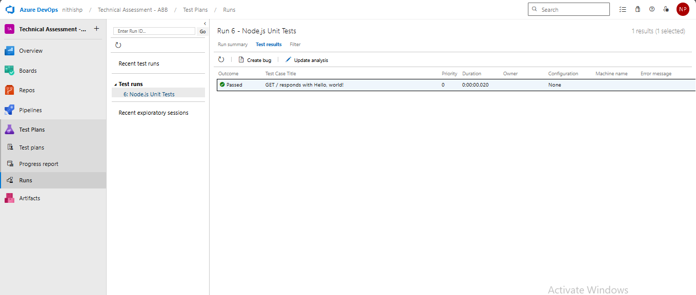
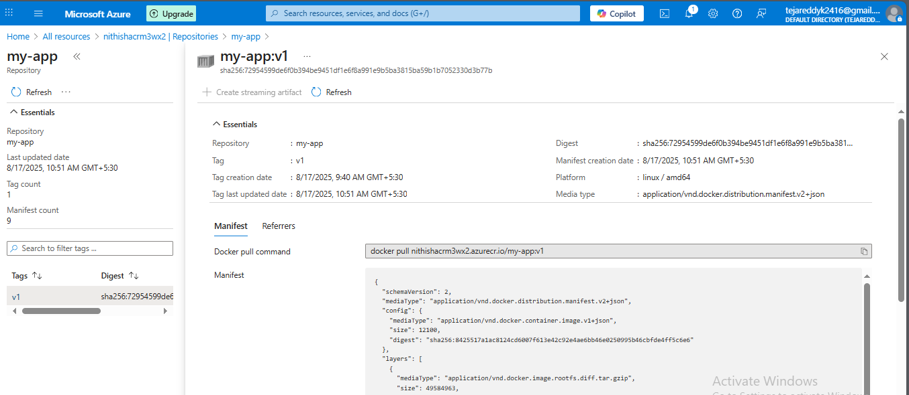
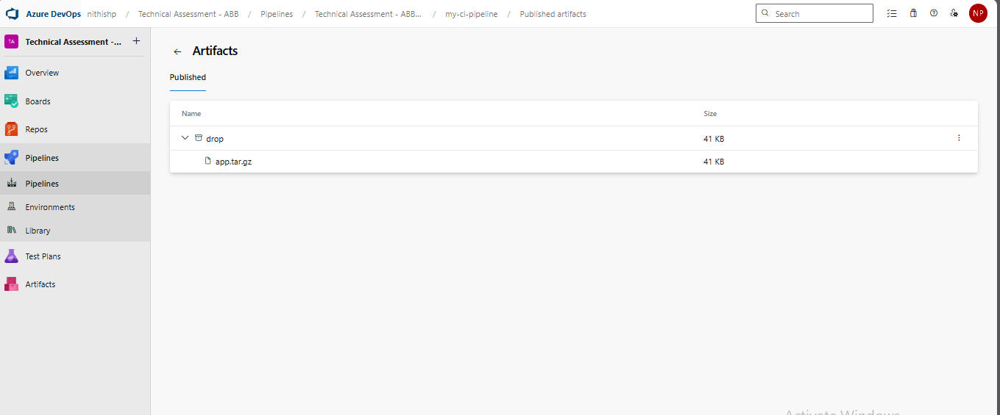
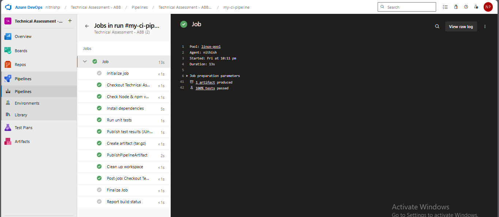

# Technical Assessment - CI Pipeline for .NET/Node.js Application

## Overview

This project demonstrates a **Continuous Integration (CI) pipeline** setup in **Azure DevOps** for a sample Node.js/.NET application. The pipeline covers the following key stages:

- Node.js environment setup  
- Dependency installation  
- Unit testing with test result publishing  
- Docker image build and push to Azure Container Registry (ACR)  
- Artifact packaging and publishing  
- Workspace cleanup  

---

## Pipeline

**Pipeline Name:** `Technical Assessment - ABB`  

> The full YAML configuration is available in `azure-devops-pipeline.yml`.  

---

## Prerequisites

- Azure DevOps organization and project setup  
- Self-hosted or Microsoft-hosted agent pool (Linux in this example)  
- Node.js 18.x installed on the agent  
- Azure CLI installed for ACR login  
- Docker installed on the build agent  
- Azure Container Registry (ACR) created  
- `jest-junit` configured in `package.json` for JUnit test report generation  

---

## Pipeline Steps Explained

| Step | Description |
|------|-------------|
| **Check Node & npm versions** | Ensures the correct Node.js and npm versions are installed on the agent. |
| **Install dependencies** | Installs project dependencies using `npm install` and `npm ci`. |
| **Run unit tests** | Executes unit tests. The environment variable `CI=true` ensures proper behavior on CI agents. |
| **Publish test results** | JUnit test results are published to Azure DevOps **Tests** tab. |
| **Docker login** | Logs in to Azure Container Registry for image push. |
| **Build Docker image** | Builds and pushes Docker image to ACR. |
| **Create artifact** | Packages application files and Kubernetes manifests into a `.tar.gz` archive. |
| **Publish artifact** | Publishes the artifact to the Azure DevOps **Artifacts** library. |
| **Clean workspace** | Deletes temporary files to free agent disk space. |

---

## Artifacts and Outputs

1. **Unit Test Reports**  
   - Location: `test-results/junit.xml`  
   - Published to **Azure DevOps Tests tab**  
   - Example screenshot:  
     

2. **Docker Image**  
   - Repository: `nithish-acr/my-app`  
   - Tag: `v1`  
   - Example screenshot from ACR:  
     

3. **Build Artifact**  
   - Location: `artifact/app.tar.gz` + `manifests/*.yaml`  
   - Published as **drop** artifact in Azure DevOps  
   - Example screenshot:  
     

4. **Job Logs**  
   - Full pipeline job logs are stored in the file: **`1_Job.txt`**  
   - Example snippet from the log:  
     ```text
     ##[section]Starting: Check Node & npm versions
     Agent name: nithish
     Agent version: 2.227.0
     ...
     node -v
     v18.17.1
     npm -v
     9.8.1
     ```
   - Full log file: https://github.com/NithishReddyGithub/CI-Pipeline/blob/main/1_Job.txt

5. **Build Logs in Azure DevOps**  
   - Logs can also be reviewed in the **Logs tab** of the pipeline run.  
   - Example screenshot:  
     

---

## How to Run the Pipeline

1. Commit your code to the `main` branch.  
2. Azure DevOps will automatically trigger the pipeline.  
3. Check the **Pipelines** tab for execution status.  
4. Review unit test results in **Tests tab**.  
5. Access built Docker images in Azure Container Registry.  
6. Download build artifacts from **Artifacts tab**.  
7. Refer to `1_Job.txt` for the complete job logs.  
